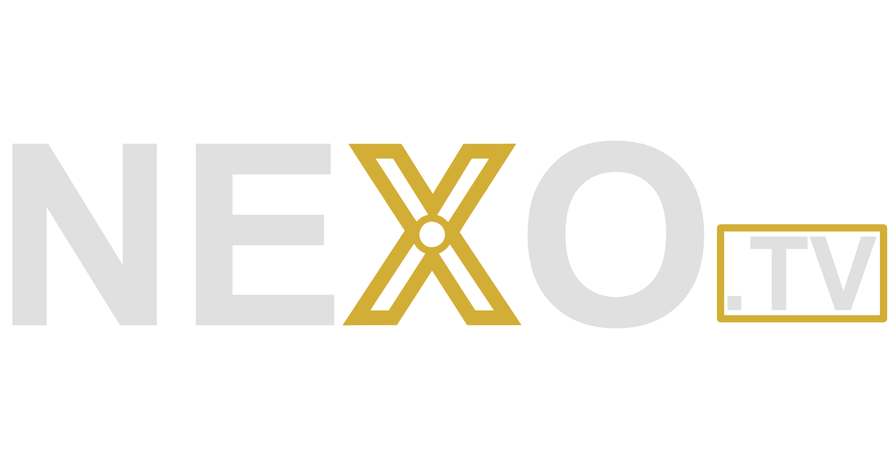

# 🎬 NEXO.TV | A Digital Film Heritage Concept

> **El cine que definió la historia** — Joyas ocultas, clásicos inmortales y el legado que las plataformas olvidaron.

---

## 📖 Sobre este Proyecto
Este repositorio es el resultado de un proyecto académico personal. El objetivo principal es demostrar habilidades en desarrollo web, gestión de bases de datos JSON y curaduría de contenidos digitales.

**Importante:** NEXO.TV no es una entidad comercial ni ofrece servicios de suscripción reales. Es una prueba de concepto (PoC) sobre cómo se podría estructurar una filmoteca digital moderna utilizando recursos legales y abiertos.

## 🚀 El Concepto
La idea detrás de NEXO es la **curaduría**. En un mar de archivos desordenados, NEXO actúa como un filtro de calidad:
* **Selección Histórica:** No subimos todo, solo lo que importa (The Essentials).
* **Valor Añadido:** Exploramos la creación de "Originals" mediante el doblaje y montaje de obras libres de derechos.
* **UX/UI Cinematográfica:** Una interfaz diseñada para dar dignidad a películas que tienen más de 100 años.

## ✨ Características Técnicas (PoC)
* **NEXO Originals:** Demostración de contenido editado (como nuestra edición de *NEXO.TV: The Original Mickey Mouse Trilogy* de 1928).
* **Streaming vía Hotlinking:** Integración directa con los servidores de Internet Archive para optimizar el almacenamiento.
* **Arquitectura:** Diseño "Mobile First" y carga dinámica de catálogo mediante archivos de datos estructurados.

## 🎞️ Catálogo Destacado (Essentials)
El proyecto incluye una selección de obras maestras que sirven para testear diferentes formatos y épocas (Alguna se añadirán proximamente):
1.  **Sin Novedad en el Frente (1930)**
2.  **Häxan (1922)**
3.  **El Chico (1921)**
4.  **Metrópolis (1927)**
5.  **Nosferatu (1922)**

## ⚖️ Aspectos Legales
Todo el contenido visualizado en este proyecto pertenece al **Dominio Público**. 
* Se han respetado las fechas de caducidad de copyright (obras publicadas hace más de 95 años).
* Este proyecto cumple con propósitos estrictamente educativos y de portfolio personal.

---

## 🛠️ Tecnologías Utilizadas
* **Frontend:** [Añade aquí: HTML/CSS/JS o Framework]
* **Hosting:** [Añade aquí: Netlify/Vercel/GitHub Pages]
* **Media:** Internet Archive (Public Domain)

## 👤 Autor
Desarrollado por **[David Ferreiro]**.

---
*Este proyecto es una carta de amor al cine clásico y al desarrollo de software.*
